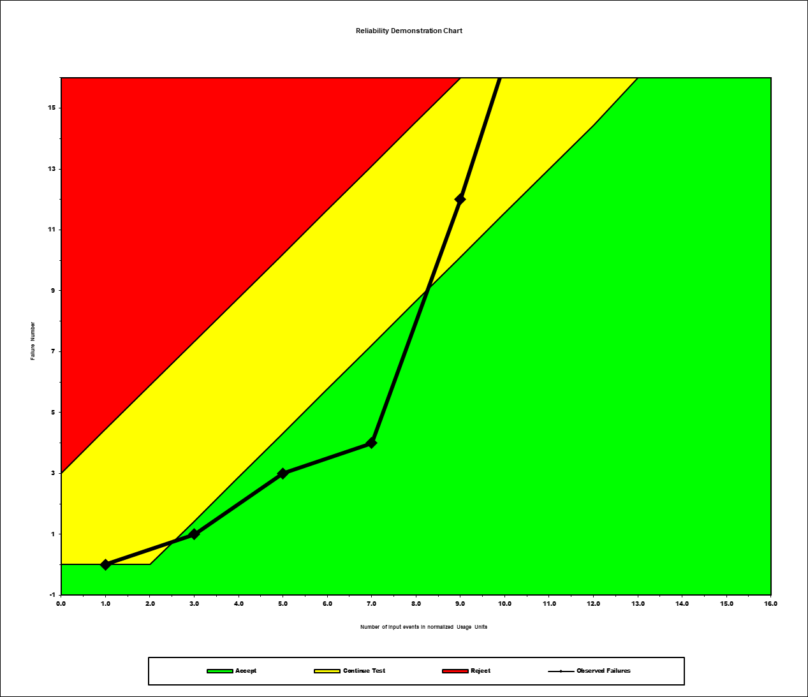

**SENG 637- Dependability and Reliability of Software Systems***

**Lab. Report \#5 – Software Reliability Assessment**

| Group: 6      |
|-----------------|
| Francis, Michael                |   
| Le, Michael              |   
| Pretorius, Jean-Charl               |   
| Rainbow, Sam                |
| Sofela, Samuel                |

# Introduction

This assignment was designed to help us develop hands-on experience with assessing the reliability of a hypothetical system, given failure data that was collected from integration testing the system. This assignment was also intended to introduce us to reliability growth assessment tools like C-SFRAT that will enable us to create failure rate and reliability plots of the system. Before this assignment, we were unfamiliar with reliability growth testing and had never measured the failure rate, mean time between failures (MTTF), and reliability of a system in the context of a software project. During this lab, the team was able to fill this knowledge gap by exploring techniques for analyzing integration testing data with reliability assessment tools such as reliability growth testing and reliability demonstration charts.

# Assessment Using Reliability Growth Testing 

For the reliability growth testing, the team chose to use the Covariate Software Failure and Reliability Assessment Tool (C-SFRAT) tool. It is very simple to use and allows users to view and compare many different models at the same time.

### Figure 1. Plot of Cumulative Failures

## REsult of Model Comparison (Selecting Top Two Models)

First, an estimation was run with all of the hazard functions and covariates selected and using all of the failure data, as can be seen in Figure 2. Then these models were analyzed to determine which models fit well with the failure data used. When using Log-Likelihood as a criteria, the two best models are the Discrete Weibull Type III (DW3) with covariate F, and the IFR Generalized Salvia & Bollinger (IFRGSB) with covariates E, F, as can be seen in Figure 3. Log-likelihood is one of the methods for assessing the goodness of fit between the software reliability growth model and the failure data, with higher log-likelihood indicating a better fit. The closer a model fits to the failure data, the more effective it is at describing the behavior of the software as it evolves. 

### Figure 2. Plot of Cumulative Failures with all Fitted Models Superimposed

### Figure 3. In-App Table Showing a Comparison of all Models, Sorted by Log-Likelihood

## Result of Range Analysis

We chose to analyze the entire dataset so that we could see the overall trend of the entire system given a failure target of 1 failure for every 10 time intervals. We chose this range so that the SUT will reach 0 defects in the projection, as can be seen in Figure 4 where the projection approaches the x-axis.

### Figure 4. Range Analysis Given Target Failure Rate

## Time-between-failures, Failure Intensity and Reliability Graphs

To analyze the reliability of the data, we decided to calculate the arimetical mean of the inter-failure times manually, as the C-SFRAT software did not have this capability, and the SRTAT wouldn't import the dataset. We chose to analyze the entire dataset to see the overall trend of system reliability growth.

### Figure 5. Time-between-Failure

### Figure 6. Failure Intensity

### Figure 7. Reliability Graph

# Assessment Using Reliability Demonstration Chart 

As the RDC application can only handle 16 data points, we took the last 16 entries in the provided failure data as our input for the RDC application. We can see in Figure 8 that the acceptable MTTF is 2 units. Figure 9 shows the MTTF of 1 unit, and Figure 10 shows the MTTF of 4 units.

### Figure 8. MTTF of 2 Units

### Figure 9. MTTF of 1 Unit

### Figure 10. MTTF of 4 Units

# Comparison of Results

The results from using C-SFRAT and RDC-11 differed pretty significantly. We attribute this mostly to the capabilities of each program. C-SFRAT is more robust in its functionality and documentation, allowing us to see more data in our results. Our C-SFRAT results show us that a target failure time should be 1 failure for every 10 units of time, while the RDC-11 show us that there should be 1 failure for every 4 units of time to be acceptable. Of course, the C-SFRAT results are for the ideal scenario of no defects, while the RDC-11 results are for a range of acceptable defects.

# Discussion on Similarity and Differences of the Two Techniques

The C-SFRAT results show us a linearized measure of reliability, while the RDC-11 results show us a range of acceptable failures. Both are objective measures of a system's quality, but view the system under different circumstances and requirements. C-SFRAT views a time-series of failures and projects the expected number of failures, while RDC-11 views the normalized number of failures and provides a visualization for an acceptable number of failures for the SUT to be released to the customer.

# How the team work/effort was divided and managed

Each team member attempted to use the provided tools, agreed to use the same tool that appeared to work the best after familiarizing ourselves with them, and cross-checked our results so that there was concensus. We worked on a common Google document before transferring our results to this report file.

# Difficulties encountered, challenges overcome, and lessons learned

All of the provided software was very difficult to use, and also very limiting in their capabilities. There was even one graph that we had to generate manually using formulae discussed in class, as the provided software did not have the capabilities to generate reliability graphs using an arithmetical mean or Laplace unit. Otherwise, the application of statistics were very interesting, and we can see the need for a user-friendly application to be developed that can provide all of the neccessary visualizations and results that this assignment asked of us.

# Comments/feedback on the lab itself

Perhaps a deliverable requiring manual calculation would be better for future labs, as using the provided software did not generate easily interpretable results, and were not user friendly at all.